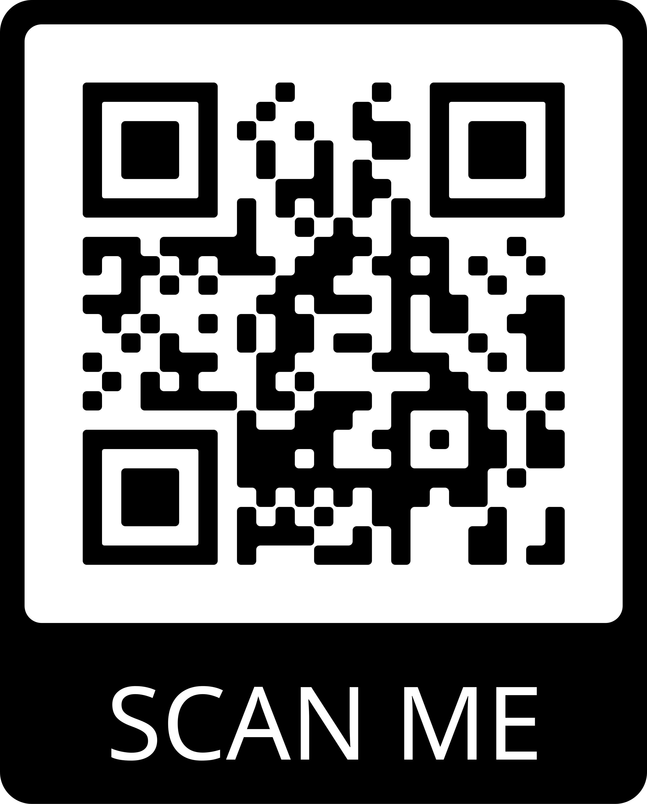

# Purpose

The purpose for this repo was just for a university assignment. For my dissertation academic poster I opted to include a QR code. The QR code will effectively navigate the reader to this website which is hosted on Netlify. It's just a simple 'call to action'. If you're interested in my academic poster (not to be confused with an advertising poster) you can find it in the director `/assets`.

# QR Code

This QR code navigates to the simple website.

